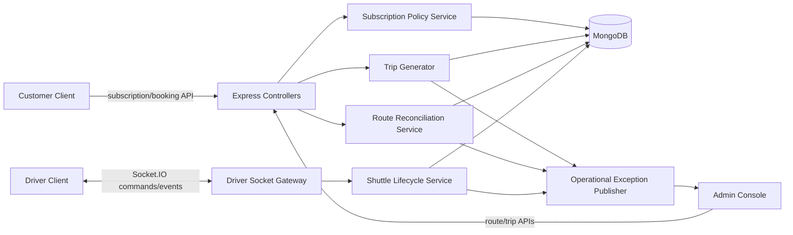

# Design Document: TORQQ Four-Model Completion Handover

## Overview

This design completes the P0/P1 handover by making `Route`, `Subscription`, `Trip`, and `ShuttleSession` authoritative for the four TORQQ service models:

| Service model | Customer interaction | Authoritative lifecycle |
|---|---|---|
| Flexy | Immediate or future on-demand booking | `SCHEDULED` → `PENDING` → driver ride lifecycle |
| Hybrid | Exactly three chosen Mon–Fri commute days | Subscription eligibility → one route/day Trip manifest entry |
| Weekday | Managed commute every Mon–Fri | Subscription eligibility → one route/day Trip manifest entry |
| Stop-to-Stop | Designated route-stop selection | Valid stop pair → one route/day Trip manifest entry |

The implementation will retain the existing Node.js/Express/Mongoose architecture and Socket.IO event style. It will centralize eligibility, route-stop validation, trip generation, and shuttle passenger transitions in backend services, keeping frontend checks as usability controls rather than policy enforcement.

Research findings informing this design:

- Existing `Route`, `Subscription`, `Trip`, and `ShuttleSession` schemas already provide most persistence fields but identify stops by mutable array index. The design adds durable stop identifiers and persists the selected stop identity in subscriptions/manifests. [Route model](../../../models/Route.js), [Subscription model](../../../models/Subscription.js), [Trip model](../../../models/Trip.js), [ShuttleSession model](../../../models/ShuttleSession.js)
- The current subscription controller performs a 5 km Haversine check and creates future trips at purchase time, but it accepts weekend Hybrid days and intermixes generation with payment flow. The design extracts deterministic policy and generator services. [Subscription controller](../../../controllers/subscriptionController.js)
- Bundled ride acceptance already creates a `ShuttleSession` and sends passenger cards, but its socket lifecycle requires hardening around durable session linkage and exact passenger targeting. [Driver socket events](../../../sockets/driverEvents.js)
- Customer and administrator pages already have plan/route selection and trip management seams for the proposed API and view models. [Customer plans page](../../../client/app/customer/(dashboard)/plans/page.tsx), [Admin trips page](../../../admin/app/trips/page.tsx)

### Design decisions

1. **Server policy is the source of truth.** UI limits (such as three Hybrid selections) improve interaction but every purchase, generator, and socket transition must be validated on the server.
2. **Store durable stop IDs, not only indexes.** A route change can reorder an array. `pickupStopId` and `dropStopId` in `Subscription` and copied snapshot IDs in a `Trip.manifest` make invalidation and reconciliation deterministic.
3. **Use idempotent create-or-update generation per route/date.** A compound unique index on active trip route and service date prevents duplicate generator runs from duplicating trips or passengers.
4. **Keep scheduled trips and on-demand shuttles separate.** `Trip` manifests are recurring-route operations; `ShuttleSession` remains the on-demand bundled-ride aggregate. Both publish a common driver passenger-card projection.
5. **Record operational exceptions.** No-driver routes can still generate an unassigned planned trip; assignment failures on a configured active driver abort the affected creation and create an observable exception.

## Architecture



### Processing flows

**Subscription purchase and recurring generation**

1. The customer client sends plan, route, service date, Hybrid weekday selections when applicable, and durable managed-stop IDs.
2. `SubscriptionPolicyService` validates plan/service compatibility, active route, distinct ordered stops, exact Hybrid weekdays, and 5 km geodesic distances for managed Home-to-Office service.
3. The controller creates a pending payment subscription only after policy acceptance. Successful payment activates the subscription.
4. `TripGenerator.generateForServiceDate(date)` retrieves active eligible subscriptions and groups them by `routeId`.
5. For each group, the generator upserts its route/date `Trip`, assigns the active route driver where available, and upserts one manifest entry per subscription.
6. A scheduled job invokes the generator for the next operating day; an idempotent administration endpoint may rerun a bounded date range for recovery.

**Flexy lifecycle**

1. Flexy plan selection opens the on-demand booking screen and cannot create a recurring subscription.
2. An immediate request is persisted as `PENDING`; a future request is persisted as `SCHEDULED` with `scheduledPickupAt`.
3. A due-time processor atomically promotes due `SCHEDULED` requests to `PENDING`; the normal matching and driver lifecycle follows.

**Shuttle lifecycle**

1. On bundle acceptance, the service transactionally creates one `ShuttleSession`, writes its ID into all accepted ride requests, creates a passenger sequence, and creates/generates per-passenger OTP state.
2. The gateway returns a passenger projection with `shuttleSessionId`, ride ID, name, pickup/drop, lifecycle state, and permitted action.
3. Pickup verification and drop completion take both `shuttleSessionId` and `rideRequestId`, verify driver ownership and prior state, and update only the selected passenger.
4. Completion of the final passenger transitions the session to `COMPLETED`.

**Route reconciliation**

1. Route-service changes are classified as driver-only, deactivation, stop deletion, stop reorder, or replacement stop resolution.
2. Driver-only changes update future non-terminal scheduled trips; completed/cancelled trips are skipped.
3. Stop-affecting changes locate future manifest entries by durable stop ID/sequence snapshot, mark conflicts `REQUIRES_RESOLUTION`, and emit an administrator exception.
4. Resolution validates replacement stops, updates subscription selections, and rebuilds future non-terminal manifest snapshots.

## Components and Interfaces

### Subscription Policy Service

`services/subscriptionPolicyService.js`

```js
validateRecurringSubscription({ customer, plan, route, startDate, selectedWeekdays, pickupStopId, dropStopId })
// -> { normalizedWeekdays, pickupStop, dropStop }

isEligibleOnServiceDate({ subscription, plan, serviceDate })
// -> boolean
```

Responsibilities:
- Enforce service type/tier compatibility.
- Resolve selected durable stop IDs from an active route and validate distinct forward ordering.
- Calculate Haversine distances server-side; accept distance `<= 5.0` exactly.
- Require exactly three unique ISO weekdays 1–5 for Hybrid.
- Allow Weekday recurrence only for ISO weekdays 1–5.
- Exclude any status other than `ACTIVE` from eligibility.

### Flexy Service and scheduler

`services/flexyService.js`, `jobs/promoteScheduledFlexyRides.js`

```js
createFlexyRide({ customerId, pickupLocation, dropLocation, pickupIntent, scheduledPickupAt })
// pickupIntent: 'IMMEDIATE' | 'SCHEDULED'

promoteDueFlexyRides(now)
// -> { promotedCount }
```

The due processor uses an atomic conditional update (`status: 'SCHEDULED'` and `scheduledPickupAt <= now`) so a retry or overlapping worker cannot promote the same request twice.

### Trip Generator

`services/tripGenerator.js`, `jobs/generateDailyTrips.js`

```js
generateForServiceDate(serviceDate, { routeIds } = {})
// -> { createdTrips, updatedTrips, manifestEntries, exceptions }

reconcileSubscription(subscriptionId, fromServiceDate)
// -> generation summary
```

The generator normalizes `serviceDate` to a local service-day window, gets eligible active subscriptions with related plans and routes, groups by route, and performs transactional upsert of a `Trip` plus uniquely keyed manifest entries. A configured active driver is copied from the route. No active configured driver produces an unassigned trip plus exception; inability to assign a configured active driver fails the affected trip and reports the exception.

### Route Reconciliation Service

`services/routeReconciliationService.js`

```js
applyDriverChange(routeId, driverId, effectiveDate)
reconcileStopChange(routeId, change, effectiveDate)
resolveManifestConflict({ subscriptionId, pickupStopId, dropStopId, effectiveDate })
```

This service is called by the route controller after a route mutation succeeds. It only changes future non-terminal trips. A conflict record is attached to the affected manifest entry and published for the administrator view.

### Shuttle Lifecycle Service

`services/shuttleLifecycleService.js`

```js
acceptBundle({ driverId, rideRequestIds, driverLocation })
verifyPassengerPickup({ driverId, shuttleSessionId, rideRequestId, otp })
completePassengerDrop({ driverId, shuttleSessionId, rideRequestId })
getDriverPassengerProjection({ driverId, shuttleSessionId, tripId })
```

Each mutating command checks the caller driver, session/ride linkage, permitted predecessor status, and OTP expiration. The service uses an atomic filter including session ID, ride ID, and prior state. It never substitutes a different passenger or an inferred next passenger.

### HTTP and Socket contracts

| Surface | Contract |
|---|---|
| `POST /customer/subscriptions/purchase` | Uses durable `pickupStopId`/`dropStopId`; returns only after policy validation and payment-order creation. |
| `POST /customer/flexy-rides` | Creates immediate or future Flexy request according to explicit pickup intent. |
| `POST /admin/trips/generate` | Protected recovery endpoint for a bounded Service_Date range; returns per-route counts and exceptions. |
| `PATCH /admin/routes/:id` | Reconciles future trips after a driver or stop topology change. |
| `GET /admin/operations/exceptions` | Lists unassigned trips, failed assignment attempts, and unresolved route conflicts. |
| `driver:shuttle:pickup-verify` | Requires `{shuttleSessionId, rideRequestId, otp}` and returns the updated passenger projection. |
| `driver:shuttle:complete-drop` | Requires `{shuttleSessionId, rideRequestId}` and returns the updated passenger projection. |
| `driver:assignment` | Pushes a `Trip` or `ShuttleSession` plus structured passenger items. |

## Data Models

### Route

Extend each stop with a stable `stopId` and enforce unique `sequenceOrder` values per route. Retain the GeoJSON Point fields and 2dsphere index. `assignedDriver` remains the current route owner.

```js
stops: [{ stopId: String, stopName, sequenceOrder, location }]
```

### Subscription

Replace mutable stop-index persistence with durable selection plus a snapshot for traceability.

```js
pickupStopId: String,
dropStopId: String,
pickupStopSequence: Number,
dropStopSequence: Number,
selectedWeekdays: [Number], // Hybrid only; values 1..5; exactly 3
```

Retain legacy indexes only during migration, backfill durable IDs, then have new writes/read paths use IDs.

### Trip

Normalize `tripDate` to the local service date. Add a unique partial index for non-deleted route/date trips and a stable manifest-entry key.

```js
{ routeId: 1, serviceDate: 1, isDeleted: 1 } // unique for active trips
manifest: [{
  subscriptionId,
  customer,
  pickupStop: { stopId, stopName, sequenceOrder, location },
  dropStop: { stopId, stopName, sequenceOrder, location },
  status: 'PENDING' | 'BOARDED' | 'DROPPED' | 'NO_SHOW',
  conflict: { state: 'NONE' | 'REQUIRES_RESOLUTION', reason, detectedAt },
  boardedAt,
  droppedAt
}]
```

### ShuttleSession and RideRequest

`ShuttleSession` remains the aggregate. `RideRequest.shuttleSessionId` is required for accepted bundled rides and indexed. The session stores sequence items keyed by RideRequest ID, with individual pickup verification and drop state. RideRequest retains the authoritative OTP code, expiry, verified marker, and per-passenger ride status.

```js
ShuttleSession.sequence: [{
  rideRequestId, type: 'PICKUP' | 'DROP', status, otpVerified, completedAt, sequenceOrder
}]
RideRequest: { shuttleSessionId, otp: { code, expiresAt, verified }, pickupAt, completedAt }
```

### Operational exceptions

Add an `OperationalException` collection or equivalent embedded operational record with `type`, `routeId`, `tripId`, `subscriptionId`, `serviceDate`, `reason`, `status`, timestamps, and resolution metadata. It must be queryable by the Admin_Console.

## Correctness Properties

*A property is a characteristic or behavior that should hold true across all valid executions of a system—essentially, a formal statement about what the system should do. Properties serve as the bridge between human-readable specifications and machine-verifiable correctness guarantees.*

The new policy, generation, reconciliation, and state-transition services are deterministic business logic with large input spaces, making property-based testing appropriate. Socket.IO, payment, MongoDB, and browser wiring remain integration/E2E concerns.

### Reflection

The prework identified overlapping properties and consolidates them as follows:

- Managed-stop order, absence, route state, and Stop-to-Stop selection rules become one `Managed stop selection validity` property, because a single validity predicate governs all of them.
- Hybrid and Weekday calendar checks become `Recurring service-date eligibility`, because eligibility is the shared predicate used by the generator.
- Route/date uniqueness, complete manifest snapshots, rerun behavior, and Stop-to-Stop manifest generation become `Idempotent route-date manifest generation`; rerun identity subsumes an isolated duplicate-count property.
- Shuttle valid pickup, invalid-action non-interference, explicit drop, and aggregate completion stay in one state-machine property because they assert one complete passenger transition system.
- Route-change detection, conflict records, driver propagation, and resolution are grouped as `Future route reconciliation` because they are one transformation over a future service graph.

### Property 1: Managed-stop distance threshold and payment safety

For all valid customer and managed-stop coordinate pairs whose calculated distances are at most 5.0 kilometres, recurring Home-to-Office validation accepts the distances; for any pair with either distance greater than 5.0 kilometres, validation rejects before a payment-order request is made.

**Validates: Requirements 1.1, 1.2, 1.3, 9.1**

### Property 2: Managed-stop selection validity

For all routes and pickup/drop selections, subscription validation accepts a selection if and only if the route is active and non-deleted, both selected stop IDs exist on that route, the stop IDs differ, and the pickup sequence order is less than the drop sequence order.

**Validates: Requirements 1.4, 1.5, 5.1, 5.2, 5.3**

### Property 3: Hybrid weekday selection validity

For all arrays of selected days, Hybrid subscription validation accepts the array if and only if it contains exactly three distinct values from Monday through Friday; every other array is rejected before a payment-order request is made.

**Validates: Requirements 2.1, 2.2, 9.2**

### Property 4: Recurring service-date eligibility

For all active and non-active Hybrid and Weekday subscriptions and Service_Dates, a Hybrid subscription is eligible exactly when the Service_Date is one of its selected Monday-through-Friday days, and a Weekday subscription is eligible exactly on Monday through Friday; all non-active subscriptions and Saturday/Sunday Weekday subscriptions are ineligible.

**Validates: Requirements 2.3, 2.4, 2.5, 9.3**

### Property 5: Flexy creation preserves pickup intent

For all valid immediate Flexy booking inputs, creation produces a `PENDING` RideRequest with immediate pickup intent; for all valid future booking inputs, creation produces a `SCHEDULED` RideRequest with the requested future scheduled pickup time.

**Validates: Requirements 3.2, 3.3**

### Property 6: Due Flexy promotion is idempotent

For all collections of scheduled Flexy RideRequests and evaluation times, the due-time processor promotes each request whose pickup time is due from `SCHEDULED` to `PENDING` once, leaves not-due requests unchanged, and produces the same persisted state when invoked repeatedly with the same time.

**Validates: Requirements 3.4, 3.5, 9.4**

### Property 7: Idempotent route-date manifest generation

For all active eligible subscription collections and Service_Dates, generation creates exactly one scheduled Trip per route/date group and exactly one `PENDING` manifest entry per eligible subscription containing that subscription’s customer and selected durable stop snapshots; rerunning generation yields an equivalent normalized route/date trip and manifest set.

**Validates: Requirements 4.1, 4.2, 4.3, 5.4, 9.5**

### Property 8: Route-driver assignment behavior

For all eligible route/date groups with an active assigned driver, every generated Trip references that driver; for any route/date group with no active assigned driver, the generated Trip is unassigned and has a corresponding operational exception.

**Validates: Requirements 4.4, 4.6, 9.5**

### Property 9: Shuttle acceptance preserves per-passenger identity

For all nonempty bundles of distinct pending RideRequests accepted by an authorized driver, every accepted RideRequest persists the same newly created ShuttleSession identifier before acknowledgement, and each passenger’s OTP, pickup, drop, and initial `PENDING` lifecycle data remain associated with that passenger’s RideRequest identifier.

**Validates: Requirements 6.1, 6.2, 9.6**

### Property 10: Shuttle passenger transitions are isolated and complete

For all valid ShuttleSessions and explicitly identified passengers, a matching authorized pickup OTP transitions only the selected `PENDING` passenger to `BOARDED`; an authorized drop transitions only the selected `BOARDED` passenger to `DROPPED`; every invalid session, ride, driver, OTP, expiry, or predecessor-state combination preserves all passenger state; and the session becomes `COMPLETED` if and only if every passenger is `DROPPED`.

**Validates: Requirements 6.3, 6.4, 6.5, 6.6, 9.6**

### Property 11: Future route reconciliation

For all Route_Changes and sets of future/terminal Trip manifests, a driver-only change updates only future non-terminal trips; a stop-affecting change marks exactly the manifests using invalidated stop snapshots as requiring resolution; and resolving a conflict with a valid forward stop pair updates the subscription and only future non-terminal manifests to the replacement snapshots.

**Validates: Requirements 7.1, 7.2, 7.3, 7.4**

### Property 12: Driver passenger projection is non-interfering

For all scheduled-trip or shuttle passenger collections, the driver projection contains the required passenger identity, location, lifecycle, and permitted-action fields for each item; applying a lifecycle update to one passenger changes only the projection item with that passenger identifier.

**Validates: Requirements 8.1, 8.2, 9.7**

## Error Handling

| Condition | Backend behavior | Client/Admin behavior |
|---|---|---|
| Invalid plan, route, stop, or schedule input | Return a typed `ValidationError` with a stable code; perform no payment order or subscription write that implies acceptance. | Display the server error against the relevant selection. |
| 5 km distance overflow | Reject on the first detected offending endpoint with endpoint and measured distance in server logs, without exposing unnecessary precision to the customer. | Prompt customer to select a closer managed stop. |
| Flexy past/malformed schedule | Reject before RideRequest creation. | Keep form input and show validation feedback. |
| Generator duplicate invocation | Upsert by route/service date and subscription manifest key; return counts rather than an error. | Admin sees the successful recovery result. |
| Missing active driver | Persist an unassigned trip and open an `UNASSIGNED_DRIVER` exception. | Admin sees trip as unassigned and can reassign. |
| Configured-driver assignment failure | Roll back the affected trip creation and open an `DRIVER_ASSIGNMENT_FAILED` exception. | Admin sees failure and can rerun after correction. |
| Route change conflict | Mark only impacted future manifest entries `REQUIRES_RESOLUTION`; do not silently substitute stops. | Admin sees affected route/trip/subscription and can select replacements. |
| Unauthorized/cross-passenger shuttle action | Reject with a stable socket error code and preserve all state. | Driver retains current passenger list and sees action feedback. |
| Duplicate/late shuttle command | Conditional update returns an idempotent state response or a typed predecessor-state error. | Driver refreshes the structured passenger card from authoritative response. |

All mutations must log correlation IDs plus route, trip, subscription, shuttle-session, and ride IDs as applicable. OTP values and payment credentials must never be recorded in production logs.

## Testing Strategy

### Test stack and boundaries

- Use Node’s built-in `node:test` and `assert` for server unit tests.
- Add `fast-check@3.23.2` as the property-based testing library. Each property test runs at least 100 iterations and contains a comment in this format: `Feature: torqq-four-model-handover, Property N: <property text>`.
- Use `mongodb-memory-server` already present in the repository for controller/repository integration tests; mock the payment provider and outbound notifications.
- Use a Socket.IO test client for bundled-shuttle event integration.
- Use the frontend’s existing test setup or introduce `@playwright/test@1.52.0` for the required cross-frontend browser E2E tests; isolate external payment in mock mode.

### Unit and property tests

1. Property tests for Properties 1–12, with generators for longitude/latitude pairs, ordered route stop sets, subscription states, Service_Dates, Flexy times, route/date groups, and multi-passenger shuttle state machines.
2. Explicit mandatory boundary examples: constructed 4.9 km and 5.0 km accepted coordinates, a >5.0 km rejected coordinate; Hybrid exactly-three, duplicates, 2/4 days, Saturday, and Sunday; parameterized Monday-to-Sunday Weekday eligibility.
3. Unit error tests for malformed date values, driver assignment persistence failure, missing route stops, legacy-index migration behavior, and stable error codes.

### Integration and E2E matrix

| Scenario | Test level | Required assertions |
|---|---|---|
| Subscription purchase | API + in-memory Mongo | Server-side geo boundary, no payment call on failed policy, valid durable stop persistence. |
| Hybrid/Weekday generation | Job + repository | Exact-three selection, daily eligibility, Mon–Fri only, one route/date trip, manifest and driver behavior, safe rerun. |
| Flexy lifecycle | API + job | Immediate PENDING, future SCHEDULED, due promotion, invalid time rejection, repeated promoter runs. |
| Stop-to-Stop | API + job | Active designated forward stops only; rejected unknown/inactive/reverse selections; selected manifest snapshots. |
| Route changes | API + repository | Driver propagation, terminal skip, conflict records, explicit valid resolution. |
| Shuttle session | Socket + Mongo | Durable session links, two distinct passenger OTPs, cross-passenger/session rejection, independent drop completion. |
| Driver frontend | Browser/component | Structured passenger cards and lifecycle update isolation. |
| Admin observability | Browser/API | Future-trip rows, passenger detail, unassigned/route-conflict/generation-failure exceptions. |

Property tests validate universal logic; example, integration, and E2E tests verify fixed boundaries, persistence, Socket.IO wiring, and UI contracts. The mandatory matrix in Requirement 9 maps directly to the rows above.
