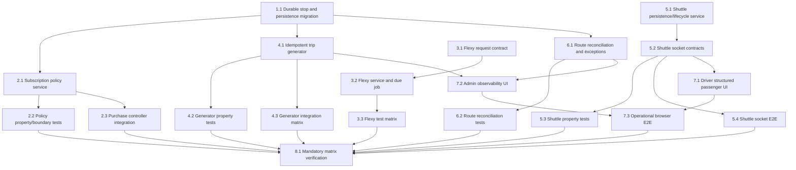

# Implementation Plan: TORQQ Four-Model Completion Handover

## Overview

Implement the TORQQ handover as a dependency-ordered DAG. Each numbered sub-task is a dispatchable leaf task for a `spec-task-execution` subagent. A leaf may begin only after its listed dependencies are complete. The plan uses JavaScript because the server implementation and design contracts are JavaScript/CommonJS; no application code is implemented by this spec workflow.

## Task Dependency Graph

```json
{
  "waves": [
    { "wave": 1, "tasks": ["1.1", "3.1", "5.1"] },
    { "wave": 2, "tasks": ["2.1", "3.2", "5.2"] },
    { "wave": 3, "tasks": ["2.2", "2.3", "3.3", "4.1", "5.3", "5.4"] },
    { "wave": 4, "tasks": ["4.2", "4.3", "6.1", "7.1"] },
    { "wave": 5, "tasks": ["6.2", "7.2"] },
    { "wave": 6, "tasks": ["7.3"] },
    { "wave": 7, "tasks": ["8.1"] }
  ]
}
```



## Tasks

- [x] 1. Establish durable route-stop and operational persistence foundations
  - [x] 1.1 Add stable route-stop IDs, durable subscription selections, manifest snapshots, and indexes
    - Modify `models/Route.js`, `models/Subscription.js`, and `models/Trip.js` to persist `stopId`, `pickupStopId`, `dropStopId`, stop sequence snapshots, manifest conflict state, and a route/service-date uniqueness strategy.
    - Create a repeatable migration/backfill utility for existing stop arrays and legacy subscription stop indexes; retain backward-compatible reads until migration completes.
    - Add `OperationalException` persistence with route, trip, subscription, Service_Date, reason, type, status, and resolution metadata.
    - _Requirements: 1.4, 1.5, 4.1, 4.2, 5.1, 5.2, 6.1, 7.2, 7.3_
    - **Depends on:** none

- [x] 2. Implement recurring subscription policy and purchase enforcement
  - [x] 2.1 Create the pure subscription policy and managed-stop validation service
    - Create `services/subscriptionPolicyService.js` with a single source of truth for active-route checks, durable forward stop resolution, server-side Haversine distance threshold, Hybrid exact-three Mon–Fri validation, and recurring Service_Date eligibility.
    - Update `controllers/subscriptionController.js` and request validation to call the policy service before creating payment orders, persist durable stop selections, and reject Flexy recurring purchases.
    - Preserve typed, stable validation codes and ensure failed policy validation makes no payment-provider call.
    - _Requirements: 1.1–1.5, 2.1–2.5, 3.1, 5.1–5.4_
    - **Depends on:** 1.1
  - [x] 2.2 Write managed-stop and calendar property/boundary tests
    - Add `fast-check@3.23.2` and server test configuration if not already present.
    - Implement **Property 1: Managed-stop distance threshold and payment safety**, **Property 2: Managed-stop selection validity**, **Property 3: Hybrid weekday selection validity**, and **Property 4: Recurring service-date eligibility** with at least 100 runs each.
    - Add explicit server-side 4.9 km accepted, 5.0 km accepted, and >5.0 km rejected cases; add Hybrid cardinality/duplicate/weekend and Mon–Sun Weekday parameterized examples.
    - _Requirements: 1.1–1.5, 2.1–2.5, 5.1–5.3, 9.1–9.3_
    - **Design properties:** 1, 2, 3, 4
    - **Depends on:** 2.1
  - [x] 2.3 Write purchase-controller integration tests
    - Test controller-level failure-before-payment behavior, active/deleted route and unknown-stop rejection, durable-stop persistence, and valid Stop-to-Stop manifest eligibility with `mongodb-memory-server` and mocked payment calls.
    - _Requirements: 1.3–1.5, 2.2, 5.1–5.4, 9.1, 9.2, 9.5_
    - **Depends on:** 2.1

- [x] 3. Implement Flexy immediate and scheduled lifecycle
  - [x] 3.1 Define Flexy RideRequest fields, API validation, and customer booking contract
    - Extend the RideRequest model/API validation with explicit pickup intent and `scheduledPickupAt` semantics required to distinguish immediate and future Flexy requests.
    - Update the customer plan and on-demand booking integration so Flexy selection navigates to booking and submits an immediate or scheduled intent without creating a recurring subscription.
    - _Requirements: 3.1–3.3_
    - **Depends on:** none
  - [x] 3.2 Implement Flexy creation service and idempotent due-time processor
    - Create `services/flexyService.js` and `jobs/promoteScheduledFlexyRides.js` using conditional transitions to create immediate `PENDING` requests, future `SCHEDULED` requests, and exactly-once due promotion.
    - Wire the job to the existing application scheduling mechanism without starting a development server from tests.
    - _Requirements: 3.2–3.5_
    - **Depends on:** 3.1
  - [x] 3.3 Write Flexy lifecycle properties and integration matrix
    - Implement **Property 5: Flexy creation preserves pickup intent** and **Property 6: Due Flexy promotion is idempotent**, each with at least 100 runs.
    - Add representative API/job tests for immediate booking, valid future booking, invalid/past time rejection, due transition, and repeated processor execution.
    - _Requirements: 3.2–3.5, 9.4_
    - **Design properties:** 5, 6
    - **Depends on:** 3.2

- [x] 4. Implement idempotent recurring Trip generation and route driver assignment
  - [x] 4.1 Create the Trip_Generator and daily-generation job
    - Create `services/tripGenerator.js` and `jobs/generateDailyTrips.js` to group active eligible subscriptions by route and local Service_Date, upsert one scheduled Trip per route/date, and upsert one manifest entry per subscription.
    - Populate durable pickup/drop snapshots, copy active route drivers, create unassigned-trip exceptions when no active driver exists, and roll back/report configured-driver assignment failures.
    - Provide a protected bounded recovery API for generation reruns.
    - _Requirements: 2.3–2.5, 4.1–4.6, 5.4, 8.5_
    - **Depends on:** 1.1, 2.1
  - [x] 4.2 Write generator properties
    - Implement **Property 7: Idempotent route-date manifest generation** and **Property 8: Route-driver assignment behavior**, each with at least 100 runs against repositories/mocks.
    - Include route/date grouping, complete `PENDING` manifest snapshots, same-date rerun identity, active driver propagation, and no-driver exception invariants.
    - _Requirements: 4.1–4.4, 4.6, 5.4, 9.5_
    - **Design properties:** 7, 8
    - **Depends on:** 4.1
  - [x] 4.3 Write generator persistence and failure integration tests
    - Use `mongodb-memory-server` to test unique route/date persistence, a configured active-driver assignment failure rollback with exception, an unassigned route result, and an administrator recovery rerun.
    - _Requirements: 4.3–4.6, 9.5_
    - **Depends on:** 4.1

- [x] 5. Complete ShuttleSession durability and per-passenger lifecycle
  - [x] 5.1 Implement transactional ShuttleSession acceptance and exact passenger lifecycle service
    - Create or refactor `services/shuttleLifecycleService.js` so bundle acceptance atomically creates a session, links every RideRequest before acknowledgement, persists passenger-specific OTP/location state, and exposes a structured passenger projection.
    - Implement exact `{shuttleSessionId, rideRequestId}` pickup and drop transitions that authorize the driver, enforce predecessor state, update only the chosen passenger, and complete the session only after all passengers are dropped.
    - Update `models/ShuttleSession.js` and `models/RideRequest.js` indexes/fields as required for durable session linkage and conditional transitions.
    - _Requirements: 6.1–6.6_
    - **Depends on:** none
  - [x] 5.2 Wire precise shuttle lifecycle Socket.IO contracts
    - Update `sockets/driverEvents.js` to delegate bundle acceptance, `driver:shuttle:pickup-verify`, and `driver:shuttle:complete-drop` to the lifecycle service.
    - Return stable acknowledgements/errors with the updated passenger projection; reject session/ride/driver/OTP mismatches without fallback to a different passenger.
    - _Requirements: 6.1–6.6, 8.1, 8.2_
    - **Depends on:** 5.1
  - [x] 5.3 Write ShuttleSession property tests
    - Implement **Property 9: Shuttle acceptance preserves per-passenger identity** and **Property 10: Shuttle passenger transitions are isolated and complete**, each with at least 100 runs.
    - Generate bundles with distinct passenger IDs/locations and invalid cross-session, cross-passenger, driver, expiry, and OTP variants.
    - _Requirements: 6.1–6.6, 9.6_
    - **Design properties:** 9, 10
    - **Depends on:** 5.2
  - [x] 5.4 Write Socket.IO bundled-ride E2E tests
    - Build a two-passenger Socket.IO/Mongo fixture that proves session persistence before acknowledgement, distinct OTP acceptance, cross-passenger rejection, independent drop completion, and final session completion.
    - _Requirements: 6.1–6.6, 9.6_
    - **Depends on:** 5.2

- [x] 6. Implement safe Route_Change reconciliation
  - [x] 6.1 Create route reconciliation and exception resolution services
    - Create `services/routeReconciliationService.js` to update future non-terminal trip drivers, detect stop deletion/reorder/deactivation conflicts using durable stop IDs/snapshots, record exceptions, and apply explicit valid replacement stop resolutions.
    - Invoke the service after route mutations in the route controller and add protected APIs to list and resolve operational exceptions.
    - _Requirements: 7.1–7.4, 8.5_
    - **Depends on:** 1.1, 4.1
  - [x] 6.2 Write Route_Change properties and persistence integration tests
    - Implement **Property 11: Future route reconciliation** with at least 100 runs.
    - Add database-backed tests for driver propagation, completed/cancelled trip skip, exact conflict detection, exception persistence, and valid replacement propagation.
    - _Requirements: 7.1–7.4, 9.5_
    - **Design properties:** 11
    - **Depends on:** 6.1

- [x] 7. Deliver structured Driver_Client and Admin_Console operations
  - [x] 7.1 Implement structured driver passenger cards and isolated lifecycle updates
    - Update the driver frontend to render a unified scheduled-trip/shuttle passenger card with passenger name, ride/trip identifier, pickup, drop, lifecycle, and status-permitted action.
    - Consume authoritative socket acknowledgements and update state by passenger identifier only.
    - _Requirements: 8.1, 8.2_
    - **Depends on:** 5.2
  - [x] 7.2 Implement Admin_Console trip, manifest, and exception observability
    - Extend administrator hooks/API clients and trip/route pages to display future trip Service_Date, route, driver or unassigned state, passenger count, per-passenger stop/lifecycle/timestamps, and actionable unassigned/conflict/generation-failure exceptions.
    - Provide resolution UI only for valid replacement-stop selections returned by the server.
    - _Requirements: 4.5, 4.6, 7.2–7.4, 8.3–8.5_
    - **Depends on:** 4.1, 6.1
  - [x] 7.3 Write driver/admin projection and browser E2E tests
    - Implement **Property 12: Driver passenger projection is non-interfering** with at least 100 runs.
    - Add browser/component tests for driver structured cards and isolated updates, plus Admin_Console assigned/unassigned trip summaries, passenger detail timestamps, and actionable exceptions.
    - _Requirements: 8.1–8.5, 9.7_
    - **Design properties:** 12
    - **Depends on:** 7.1, 7.2

- [x] 8. Finalize the mandatory automated handover matrix
  - [x] 8.1 Run and stabilize the complete automated matrix without application deployment
    - Execute the server unit/property suite, API/repository integration suite, Socket.IO shuttle E2E suite, and frontend browser/component suite in non-watch mode.
    - Verify traceability to every Requirement 9 scenario, preserve reproducible fixtures/seeds, and fix only test or implementation defects exposed by the suites.
    - _Requirements: 9.1–9.7_
    - **Depends on:** 2.2, 2.3, 3.3, 4.2, 4.3, 5.3, 5.4, 6.2, 7.3

## Notes

- The graph has no orphan leaf: every implementation leaf either enables an immediately dependent validation/UI leaf or contributes directly to final matrix verification.
- Each property task maps one design property to one property-based test with a minimum of 100 iterations and a `Feature: torqq-four-model-handover, Property N: ...` comment.
- Tests are intentionally mandatory rather than marked optional because Requirement 9 defines the release handover evidence.
- Begin implementation by opening this file and clicking **Start task** on a dependency-free leaf task: `1.1`, `3.1`, or `5.1`.
